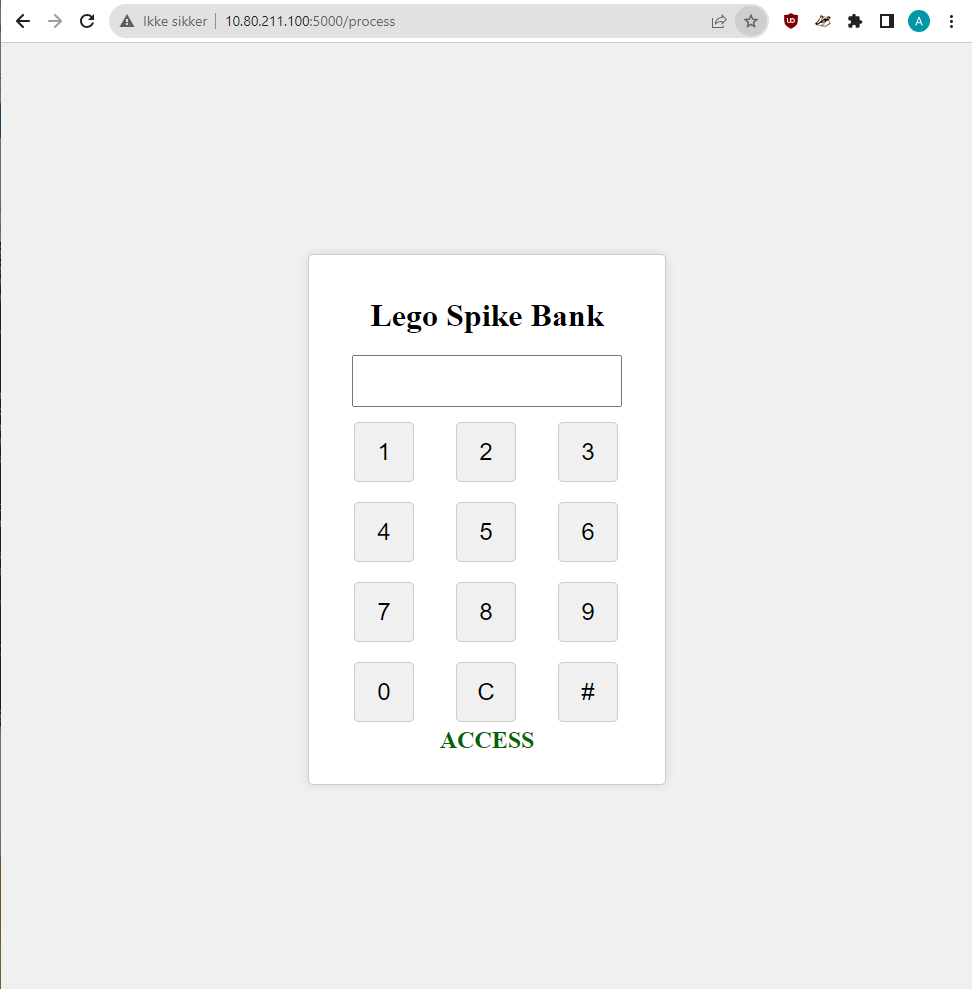

# Lego_vault
This project builds on the Lego Spike lesson: [Keep It Safe](https://education.lego.com/en-au/lessons/prime-kickstart-a-business/keep-it-safe/). 

## Needed parts
- [LEGO® Education SPIKE™ Prime-sæt](https://www.lego.com/en-dk/product/lego-education-spike-prime-set-45678)
- [Powersupply for Raspberry Pi Build Hat](https://raspberrypi.dk/produkt/officiel-raspberry-pi-build-hat-stroemforsyning-8v-6a-eu/)
- [Raspberry Pi Build HAT for use with LEGO®](https://raspberrypi.dk/en/product/raspberry-pi-build-hat/)
- [Raspberry Pi 4 Model B](https://raspberrypi.dk/produkt/raspberry-pi-4-model-b-2-gb/)


The project also makes use of the [Raspberry Pi Build Hat](https://www.raspberrypi.com/products/build-hat/).
<p align="center">
  </img>
</p>


# Setting up the Bank Vault
## Creating virtual encironment
### Linux (Raspberry Pi OS)
Use the venv module to create a virtual environment
```
python3 -m venv .venv
```
Then, activate the environment:
```
. ./.venv/bin/activate
```


#### Installing the dependencies
With the virtual environment activated, install the dependencies

```
pip install flask
pip install buildhat
pip install requests
```

Example on the Raspberry Pi:

```
(venv)pi@raspberrypi:~/LEGO $ pip install flask, buildhat
```

Before we can run the server, we need to create (or download) a ```.env``` file. This file contains our pin number and should be formatted like so; `pin='1234'`.
The project contains an app.py file, which is the Lego Vault server. Run it with the following command[^1]:

```
flaks --app app run --host=0.0.0.0
flask run --host=0.0.0.0
```
[^1]: If debug is set to True it returns some errors with the LEGO Buildhat serinterface.py. 
  So you need to run the script without debug off!


Now that the Bank Vault Server is running, you can open a browser window on a computer connected to the same network as the Raspberry Pi, go to the ipaddress for the Pi and the correct port (5000). Eg. `http://10.80.211.100:5000` or `http://192.168.0.100:5000`. You should be presentated with a keypad. Press the 4 numbers and then # to send the pin code. If the correct pin code is pressed, it should print "ACCESS" and open the lock on the vault. 

[](https://youtu.be/GaOmDu-yShU)

<p align="center">
  </img>
</p>

### Creating a Systemd Service
The script will close, even if detached from the terminal, when the user logs out or closes the ssh connection. We can create a systemd service for the lego_vault script that will start every time we boot the Pi.

Create a service by creating a file at /etc/systemd/system
```
sudo nano /etc/systemd/system/lego_vault.service
```
Let the file contain the following

```
[Unit]
Description=uWSGI instance to server LEGO Vault Project
After=network.target

[Service]
Type=simple
User=pi
WorkingDirectory=/home/pi/LEGO/
Environment="PATH=/home/pi/LEGO/venv/bin"
ExecStart=/home/pi/LEGO/venv/bin/python3 /home/pi/LEGO/app.py

[Install]
WantedBy=multi-user.target
```
Activate the service with:
```
sudo systmectl start lego_vault.service
```
Or enable it - making it start automaticaly when the Pi boots.
```
sudo systemctl enable lego_vault.service
```

## Install ufw firewall and block ip
If you want, you can install UFW on the Raspberry Pi and block a user who has oppened the vault. 
This requires that you have the IP from the user. You can get that by creating an account on https://ntfy.sh and listen to a topic. 
Then uncomment the ntfy_topic, ntfy_url and ntfy_responce = requests.post(ntfy_url, data=ntfy_data) lines in the app.py script. 

Install the ntfy app on your phone or use the web app. 
You will be notified when a user has opned the vault and get their IP address.

### Install UFW
```
sudo apt install ufw
```
Then block the ip
```
sudo ufw insert 1 deny from <IP ADDRESS>
```


# Setting up the Clients Brute Forcing script
## Linux

### Creating virtual encironment
Use the venv module to create a virtual environment

```
python3 -m venv .venv

. ./.venv/bin/activate
```

##### Installing the dependencies
With the virtual environment activated, install the dependencies

```
pip install requests
```

##### Running the script
```
python3 brute_force.py <Bank Vault IP> <port>
```

## Windows

### Creating virtual encironment
Use the venv module to create a virtual environment

```
py -m venv .venv

.venv\Scripts\activate
```

##### Installing the dependencies
With the virtual environment activated, install the dependencies

```
pip install requests
```

##### Running the script
```
py brute_force.py <Bank Vault IP> <port>
```


# Alternative

An alternative way to run the Bank is by using the bank_app. This is an app that uses sockets to send and receive data from a client.
### Run the Bang App Server
```
python3 bank_app.py
```

### Run the bank_client.py
We can use the bank_client.py to brute force the bank
```
python3 bank_client.py
```

We can also use Netcat to send data:
```
nc <IP> <PORT>

pi@raspberry:~ nc 10.80.211.100 8000
3333
Access denied!
4444
Access Granted
```
