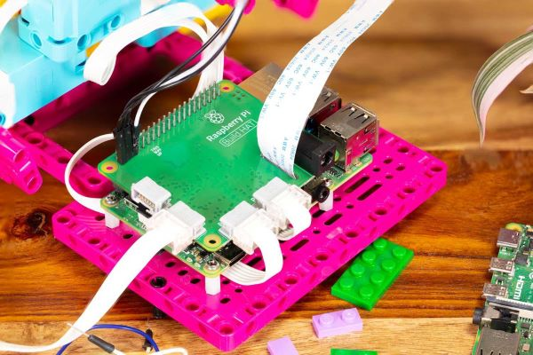

# Lego_vault
This project builds on the Lego Spike lesson: [Keep It Safe](https://education.lego.com/en-au/lessons/prime-kickstart-a-business/keep-it-safe/). 

The project also makes use of the [Raspberry Pi Build Hat](https://www.raspberrypi.com/products/build-hat/).

  

Testing stuff

