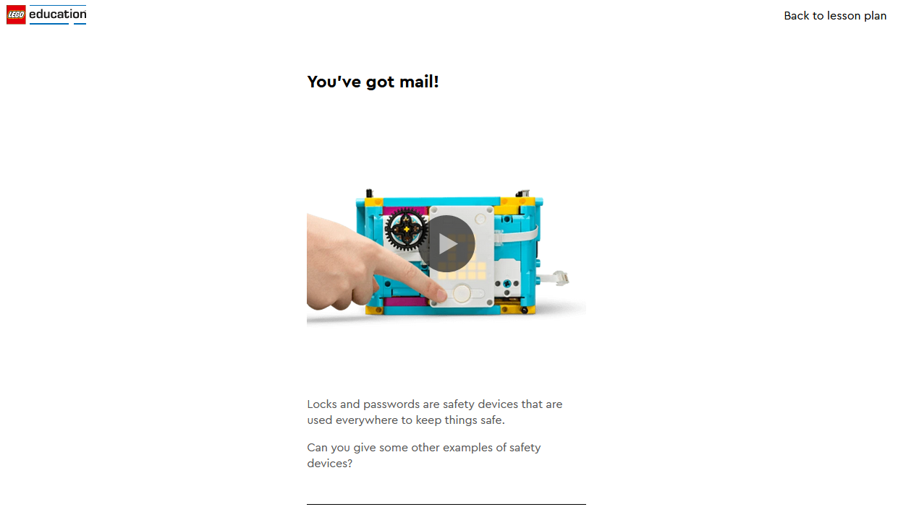

# Lego_vault
This project builds on the Lego Spike lesson: [Keep It Safe](https://education.lego.com/en-au/lessons/prime-kickstart-a-business/keep-it-safe/). 

## Needed parts
- [LEGO® Education SPIKE™ Prime-sæt](https://www.lego.com/en-dk/product/lego-education-spike-prime-set-45678)
- [Powersupply for Raspberry Pi Build Hat](https://raspberrypi.dk/produkt/officiel-raspberry-pi-build-hat-stroemforsyning-8v-6a-eu/)
- [Raspberry Pi Build HAT for use with LEGO®](https://raspberrypi.dk/en/product/raspberry-pi-build-hat/)
- [Raspberry Pi 4 Model B](https://raspberrypi.dk/produkt/raspberry-pi-4-model-b-2-gb/)




The project also makes use of the [Raspberry Pi Build Hat](https://www.raspberrypi.com/products/build-hat/).
<p align="center">
  </img>
</p>


# Setting up the Bank Vault
## Creating virtual encironment
### Linux (Raspberry Pi OS)
Use the venv module to create a virtual environment
```
python3 -m venv .venv
```
Then, activate the environment:
```
. ./.venv/bin/activate
```
`. ./.venv/bin/activate`

#### Installing the dependencies
With the virtual environment activated, install the dependencies

```
pip install flask
pip install buildhat
```

Example on the Raspberry Pi:

```
(venv)pi@raspberrypi:~/LEGO $ pip install flask, buildhat
```

Before we can run the server, we need to create (or download) a ```.env``` file. This file contains our pin number and should be formatted like so; `pin='1234'`.
The project contains an app.py file, which is the Lego Vault server. Run it with the following command:

```
flask run --host=0.0.0.0
```

Now that the Bank Vault Server is running, you can open a browser window on a computer connected to the same network as the Raspberry Pi, go to the ipaddress for the Pi and the correct port (5000). Eg. `http://10.80.211.100:5000` or `http://192.168.0.100:5000`. You should be presentated with a keypad. Press the 4 numbers and then # to send the pin code. If the correct pin code is pressed, it should print "ACCESS" and open the lock on the vault. 

[](https://youtu.be/GaOmDu-yShU)  


# Setting up the Clients Brute Forcing script
## Linux

### Creating virtual encironment
Use the venv module to create a virtual environment

```
python3 -m venv .venv

. ./.venv/bin/activate
```

##### Installing the dependencies
With the virtual environment activated, install the dependencies

```
pip install requests
```

##### Running the script
```
python3 brute_force.py <Bank Vault IP> <port>
```

## Windows

### Creating virtual encironment
Use the venv module to create a virtual environment

```
py -m venv .venv

.venv\Scripts\activate
```

##### Installing the dependencies
With the virtual environment activated, install the dependencies

```
pip install requests
```

##### Running the script
```
py brute_force.py <Bank Vault IP> <port>
```
